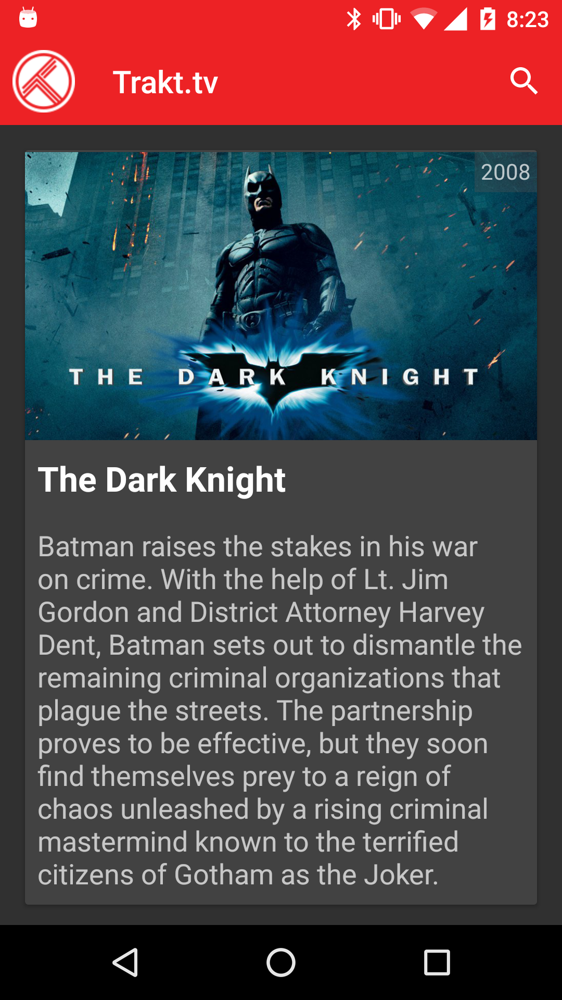
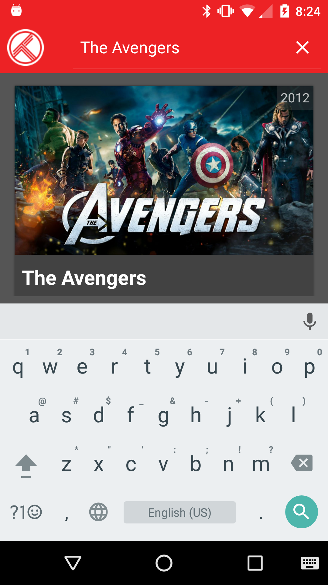

Trakt.tv Application
===========================

This repository holds the source code of the Trakt.tv Application, a simple Android client for the [Trakt.tv](http://trakt.tv).
This application was created by [Mohsen Mirhoseini Argi](http://mirhoseini.com), as part of the technical assessment by the [Trivago](http://trivago.com) team.

--------------------
### What is this repository for? ###

* Trakt.tv Application
*       Version:  1.0
* Last Update: Wed Jul 20, 2016

--------------------
### Development Tools ###

* Android Studio v2.1.2
* gradle-plugin v2.10
* Android SDK Build Tools v24.0.0
* CompileSDKVersion 24

--------------------
### Dependencies ###

* Android Support Tools (recyclerView, cardView, vector,... ) v24.0.0
* Retrofit v2.0.0-beta4
* Okhttp v3.2.0
* Dagger v2.4
* RxJava v1.1.3
* RxAndroid v1.1.0
* Butterknife v8.0.1
* Timber v4.1.2
* AndroidUtils v1.0.0
* jUnit v4.12
* Android Test v0.4.1
* Mockito v1.10.19
* Robolectric v3.1-rc1
* Espresso v2.2.2

--------------------
### Important Notes ###

The application has two Activity, Splash and Main Activities. The Main Activity is responsible for presenting Popular Movies List and Searching.

All activity lifecycle and network behaviours are implemented, and according to device size and network situation user get a good UI and UX. In case having update cache data, app do not call Network. If no internet connection or network error, a dialog pops up and ask user to turn on network connection or retry.

Application network cache on Disk cause it work smooth and result a good UX.

Some simple Test Cases was designed to test application UI functionality and core classes using jUnit and AndroidUnitTest.

### Application Structure ###

The Application implemented and structured bases on the MVP pattern best practice, contributed by [Antonio Leiva](http://antonioleiva.com/mvp-android/).

Whole application functionality is implemented in "Core-Lib" module using pure Java. The "App" module contain all codes required for application to load on Android.

The view (MainActivity), contain two fragments, Popular Movies and Search Movies Fragments. Both fragments contain their own presenters and implement View interfaces and the only thing that the view will do is calling a method from the presenter every time there is an interface action.

The presenters (Popular and Search Presenters), are responsible to act as the middle man between views and models. It retrieves data from the model and returns it formatted to the view. It also decides what happens when you interact with the view.

The models (Popular and Search Interactor), would only be the gateway to the service domain layer or business logic. In this case it provide the data we want to display in the view from Network or cached data.

The networking and API call are managed by [Retrofit](http://square.github.io/retrofit/) and OkHttp as its httpclient, contributed by [Square](http://square.github.io). It also shows decent logs while application is running in Debug mode. The whole caching and offline interceptors are also implemented using these libraries. 

Layers communications are managed by [RxJava](https://github.com/ReactiveX/RxJava) & [RxAndroid](https://github.com/ReactiveX/RxAndroid) contributed by [ReactiveX](http://reactivex.io). The live search delay before completing the search query is also implemented using this library.

Dependency Injections are being managed by [Dagger](https://github.com/google/dagger) created by [Square](http://square.github.io) and now maintained by [Google](http://google.github.io/dagger/).

Some minor Android common functions are managed using [AndroidUtils](https://github.com/mmirhoseini/utils) library, developed and published on jCenter by [myself](http://mirhoseini.com).

Whole projects Dependencies are placed in "libraries.gradle" to avoid version conflicts and redundant in different modules.

Used new DataBinding library contributed by Google in Adapters for faster development, and added CustomBindingAdapter to handle downloading and caching images using [Picasso](http://square.github.io/picasso/) library.

The endless list is being handled using EndlessRecyclerViewScrollListener which wait for the end of the list and trigger the next page api call.

The Android usual Log system is replaced with [Timber](https://github.com/JakeWharton/timber) contributed by Jake Wharton and avoid logging in release version.

Used new SupportVector library in some icons cases for a better UI.

Sample test cases are implemented by mockito, espresso, robolectric and mocking dagger.